# AI Projects for Cloud Solution Architects


A curated portfolio of **12 AI project ideas** — each with a step-by-step build guide — for Cloud Solution Architects at Microsoft CSU Cloud & AI, plus a **production-hardening guide** for taking them to production. Build them to **sharpen your AI skills**, **show customers what's possible**, and **kick-start co-build POCs**. Everything runs on **Microsoft Foundry** (not standalone Azure OpenAI, not third-party).

You know cloud. These projects build your fluency with the AI stack and leave you with working demos on your laptop — not slides. So when a customer asks *"so what can this actually do?"*, you show them.

---

## What's in This Repo

| Path | What it is |
|------|------------|
| **This README** | The portfolio — all 12 projects, the production-hardening guide, the roadmap, architecture patterns, and the model cheat sheet |
| [`docs/how-to/`](docs/how-to/) | A complete step-by-step build guide for each project (real code, CLI commands, architecture, cleanup) |
| [`src/`](src/) | Working Python for the first project ([`ask_my_docs.py`](src/ask_my_docs.py)) plus a [`cleanup.py`](src/cleanup.py) helper |
| [`.env.example`](.env.example) | Template for the one required environment variable |
| [`outputs/`](outputs/) | Generated demo results (markdown + JSON) |

Each project below links directly to its how-to guide — **the project description tells you *why* to build it; the guide tells you *how*.**

---

## Who This Is For

Cloud Solution Architects with solid cloud/dev backgrounds who want hands-on depth with Azure AI and Microsoft Foundry. Every project serves up to three purposes:

- **Learn** — build real fluency with a specific Foundry capability by shipping working code.
- **Demo asset** — something you build once and pull up in any customer meeting.
- **Co-build template** — a POC starter you clone, swap in a customer's data, and deploy in a sprint.

---

## Get Started

Being effective with AI customers takes two things: confidence you can actually build on the stack, and something real to show. Slides won't get you there. A working demo will.

1. **Set up your environment** (see [Prerequisites](#prerequisites) below).
2. **Build [01 — Ask My Docs](docs/how-to/01-ask-my-docs.md) first.** It's runnable code already in this repo — RAG over your documents in an afternoon.
3. **Then follow the [build order](#suggested-build-order).** It tells you what order to tackle the rest.

> Start with the first three. The best demo is the one you've actually built, broken, and fixed.

### Prerequisites

- Azure subscription with Microsoft Foundry access
- Azure CLI (`az`) installed and logged in
- Python 3.11+ (or .NET 8+, depending on the idea)
- VS Code with the Foundry extension (optional but recommended)

```bash
# Install Azure CLI
winget install Microsoft.AzureCLI

# Log in
az login

# Create a Foundry resource and project in the portal: https://ai.azure.com

# Install the core dependencies (the guides add their own per-project extras)
pip install -r requirements.txt
```

---

## The 12 Projects (+ Production-Hardening Guide) at a Glance

Ordered roughly by difficulty. Start at the top. Project 13 is a production-hardening guide that applies across the portfolio.

| # | Project | Type | Difficulty | Effort | Guide |
|---|---------|------|------------|--------|-------|
| 1 | Ask My Docs — RAG Starter | Demo asset | ⭐⭐ | 1–2 days | [Guide 01](docs/how-to/01-ask-my-docs.md) |
| 2 | Meeting Minutes Agent | Demo asset | ⭐⭐ | 2–3 days | [Guide 02](docs/how-to/02-meeting-minutes-agent.md) |
| 3 | Customer Email Triage Agent | Co-build | ⭐⭐ | ~1 week | [Guide 03](docs/how-to/03-email-triage-agent.md) |
| 4 | Internal Policy Chatbot | Co-build | ⭐⭐ | ~1 week | [Guide 04](docs/how-to/04-policy-chatbot.md) |
| 5 | Contract Clause Analyzer | Co-build | ⭐⭐⭐ | ~2 weeks | [Guide 05](docs/how-to/05-contract-clause-analyzer.md) |
| 6 | Multi-Agent Incident Responder | Demo asset | ⭐⭐⭐ | ~2 weeks | [Guide 06](docs/how-to/06-multi-agent-incident-responder.md) |
| 7 | Data Pipeline QA Agent | Co-build | ⭐⭐⭐ | 2–3 weeks | [Guide 07](docs/how-to/07-data-pipeline-qa-agent.md) |
| 8 | Voice-Enabled Field Assistant | Demo asset | ⭐⭐⭐ | 2–3 weeks | [Guide 08](docs/how-to/08-voice-field-assistant.md) |
| 9 | Competitive Intelligence Dashboard | Co-build | ⭐⭐⭐⭐ | 3–4 weeks | [Guide 09](docs/how-to/09-competitive-intelligence-dashboard.md) |
| 10 | Agentic Workflow for Approvals | Co-build | ⭐⭐⭐⭐ | 4–6 weeks | [Guide 10](docs/how-to/10-agentic-approval-workflow.md) |
| 11 | Computer-Use Process Automator | Demo asset | ⭐⭐⭐⭐ | 4–6 weeks | [Guide 11](docs/how-to/11-computer-use-automator.md) |
| 12 | Multi-Modal Quality Inspector | Co-build | ⭐⭐⭐⭐⭐ | 6–8 weeks | [Guide 12](docs/how-to/12-multimodal-quality-inspector.md) |
| 13 | Foundry Cross-Region Failover *(production-hardening)* | Architecture | ⭐⭐⭐⭐⭐ | varies | [Guide 13](docs/how-to/13-cross-region-failover.md) |

---

## The Projects

### 1. [Ask My Docs — RAG Starter Kit](docs/how-to/01-ask-my-docs.md)

**Demo asset · 1–2 days**

Every customer asks some version of *"Can AI search our documents?"* This is your answer — a working demo, not a slide about RAG. Set up a prompt agent in Foundry Agent Service, enable File Search, upload a handful of PDFs, and you have a grounded chatbot that answers questions and cites where it found them.

**You'll use:** Foundry project + prompt agent, File Search tool, GPT-4.1-mini or GPT-5.4-mini, Azure Blob Storage.

<details>
<summary>📐 <strong>Architecture diagram</strong></summary>

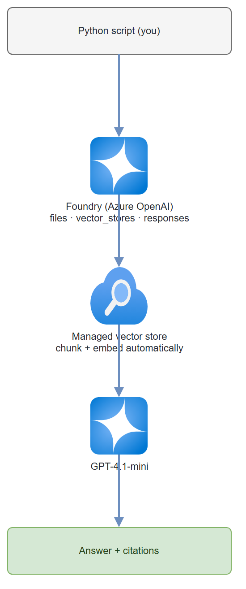

</details>

📘 **Build it:** [Guide 01 — Ask My Docs](docs/how-to/01-ask-my-docs.md) · runnable code at [`src/ask_my_docs.py`](src/ask_my_docs.py)

---

### 2. [Meeting Minutes Agent](docs/how-to/02-meeting-minutes-agent.md)

**Demo asset · 2–3 days**

The demo where people lean forward and say *"wait, I actually want that."* Audio in, structured notes out: transcribe a meeting with Foundry audio models, then hand the transcript to a prompt agent that extracts action items, decisions, and a summary.

**You'll use:** Foundry, GPT-4o audio or Whisper (transcription), GPT-4.1-mini (summarization), Foundry Agent Service. Optional: Azure Functions timer trigger for batch.

<details>
<summary>📐 <strong>Architecture diagram</strong></summary>

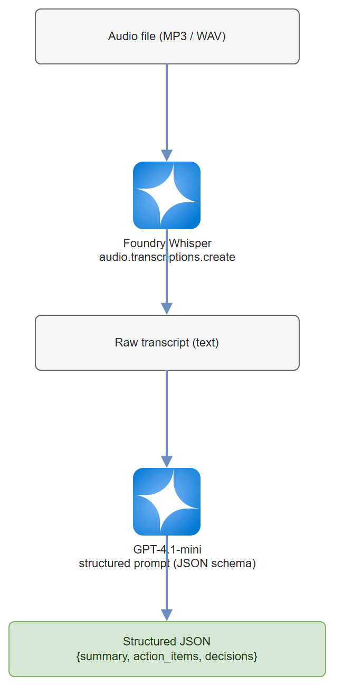

</details>

📘 **Build it:** [Guide 02 — Meeting Minutes Agent](docs/how-to/02-meeting-minutes-agent.md)

---

### 3. [Customer Email Triage Agent](docs/how-to/03-email-triage-agent.md)

**Co-build template · ~1 week**

Every support inbox is drowning. Build an agent that reads tickets from a queue, classifies by urgency and topic, drafts a response, and routes to the right team. The lesson: multi-model routing — GPT-4.1-mini for cheap-and-fast classification, GPT-5.4-mini for customer-facing drafting. Match the model to the job.

**You'll use:** Foundry (prompt agent with function calling), GPT-4.1-mini + GPT-5.4-mini, Azure Service Bus, Azure AI Search + Foundry IQ, Azure Cosmos DB.

<details>
<summary>📐 <strong>Architecture diagram</strong></summary>

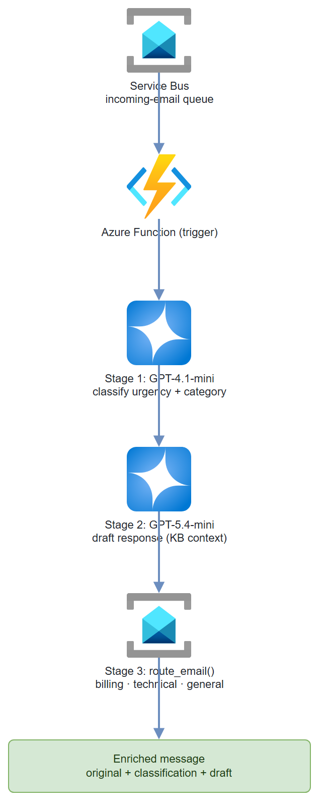

</details>

📘 **Build it:** [Guide 03 — Email Triage Agent](docs/how-to/03-email-triage-agent.md)

---

### 4. [Internal Policy Chatbot](docs/how-to/04-policy-chatbot.md)

**Co-build template · ~1 week**

*"How many vacation days do I have left?"* The answer is in a 200-page PDF nobody reads. This one uses **Foundry IQ** — turnkey RAG that handles chunking and embedding for you. The skill you're building: knowing when the managed path is the right call (start here, graduate to custom RAG when you need chunking control).

**You'll use:** Foundry with Foundry IQ, GPT-4.1-mini, Microsoft Entra ID (auth), Azure App Service (chat UI).

<details>
<summary>📐 <strong>Architecture diagram</strong></summary>

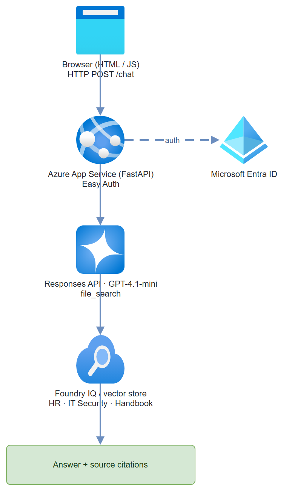

</details>

📘 **Build it:** [Guide 04 — Policy Chatbot](docs/how-to/04-policy-chatbot.md)

---

### 5. [Contract Clause Analyzer](docs/how-to/05-contract-clause-analyzer.md)

**Co-build template · ~2 weeks**

Legal review runs at $500/hour. Build an agent with Code Interpreter that extracts clauses, flags risky language against a configurable ruleset, and produces a clause-by-clause risk summary. When it correctly flags an indemnification clause with unusual liability caps, you get the attention of the CFO and General Counsel — not just IT.

**You'll use:** Foundry (prompt agent with Code Interpreter), GPT-5.4 (1M-token context fits the whole contract), Azure AI Document Intelligence, Blob Storage, Cosmos DB.

<details>
<summary>📐 <strong>Architecture diagram</strong></summary>

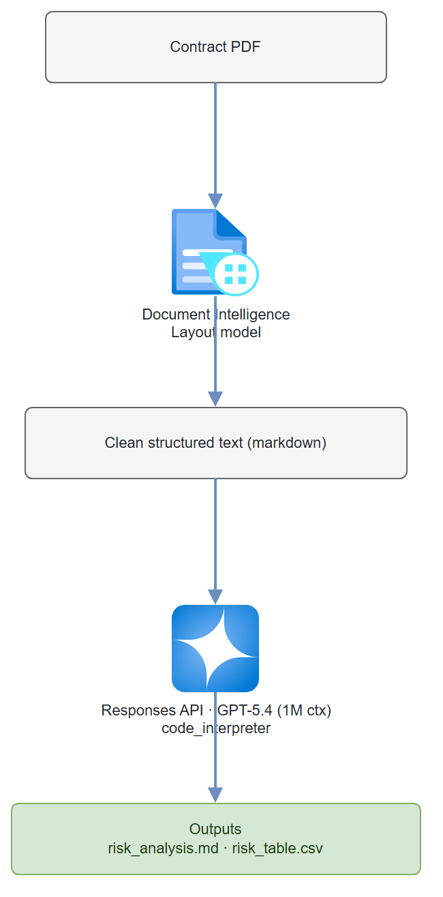

</details>

📘 **Build it:** [Guide 05 — Contract Clause Analyzer](docs/how-to/05-contract-clause-analyzer.md)

---

### 6. [Multi-Agent Incident Responder](docs/how-to/06-multi-agent-incident-responder.md)

**Demo asset · ~2 weeks**

Your *"I didn't know you could do that"* demo. Three agents, one incident, all working concurrently: a **Diagnostician** reads logs and metrics, a **Researcher** searches runbooks and past incidents, and a **Communicator** drafts stakeholder updates. This is where multi-agent orchestration stops being abstract.

**You'll use:** Foundry (workflow agent orchestrating 3 prompt agents), GPT-5.4-mini, Azure Monitor / Application Insights, Azure AI Search. For code-level control: Microsoft Agent Framework.

<details>
<summary>📐 <strong>Architecture diagram</strong></summary>

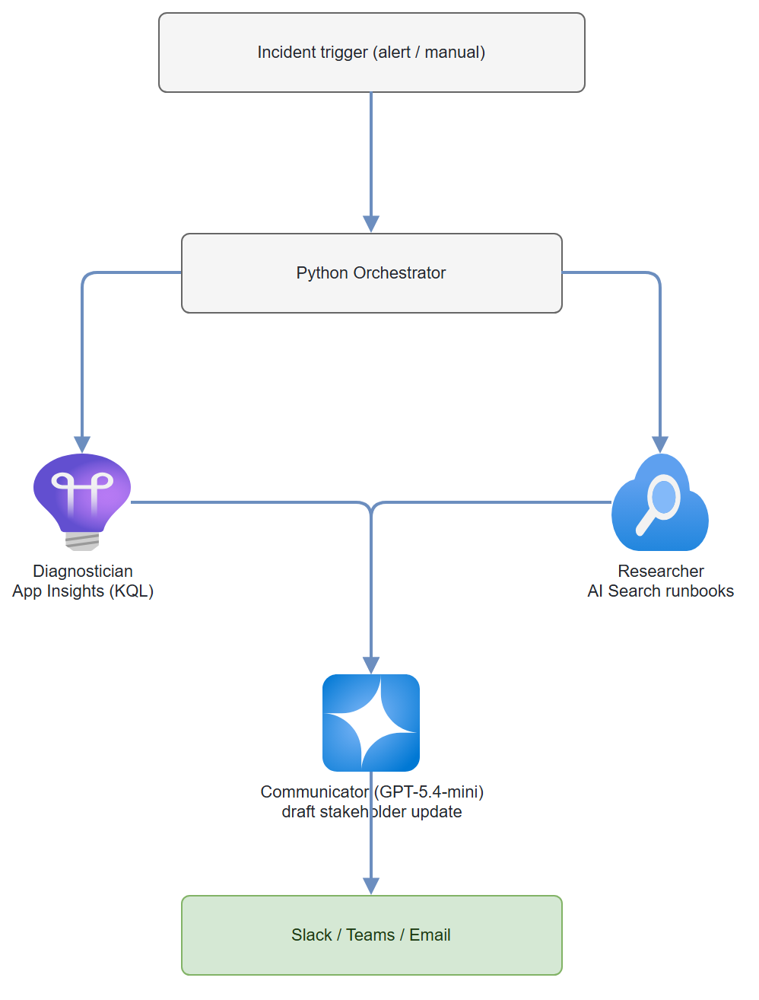

</details>

📘 **Build it:** [Guide 06 — Multi-Agent Incident Responder](docs/how-to/06-multi-agent-incident-responder.md)

---

### 7. [Data Pipeline QA Agent](docs/how-to/07-data-pipeline-qa-agent.md)

**Co-build template · 2–3 weeks**

Nobody wants to find bad data in a dashboard two days after the pipeline broke. Build an agent that runs quality checks when a pipeline completes — null spikes, schema drift, distribution shifts — and either auto-remediates or pings the data team with a diagnosis. GPT-4.1-mini with Code Interpreter does the statistical work: cheap, and it writes its own Python to compute z-scores and flag anomalies against historical baselines.

**You'll use:** Foundry (Responses API with Code Interpreter), GPT-4.1-mini, Azure Functions (Event Grid trigger), Azure Blob Storage, Data Factory or Microsoft Fabric (event source).

<details>
<summary>📐 <strong>Architecture diagram</strong></summary>

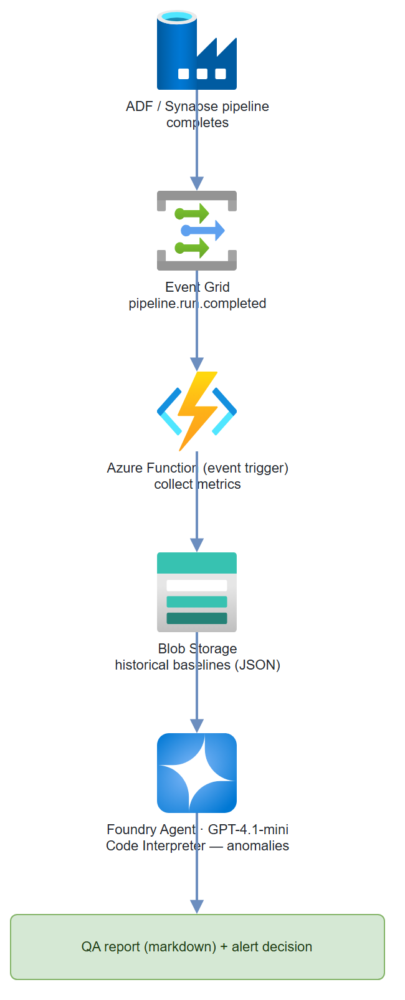

</details>

📘 **Build it:** [Guide 07 — Data Pipeline QA Agent](docs/how-to/07-data-pipeline-qa-agent.md)

---

### 8. [Voice-Enabled Field Assistant](docs/how-to/08-voice-field-assistant.md)

**Demo asset · 2–3 weeks**

*"What's the torque spec for the Model 7200 compressor valve?"* — asked out loud, hands full, answered out loud from the actual equipment manual. A mobile-friendly web app on GPT-4o Realtime for low-latency voice. Manufacturing and energy customers light up when their own technical docs answer voice queries.

**You'll use:** Foundry, GPT-4o Realtime, Azure AI Search (manual index with text-embedding-3-large), Azure Container Apps, App Service, Blob Storage.

<details>
<summary>📐 <strong>Architecture diagram</strong></summary>

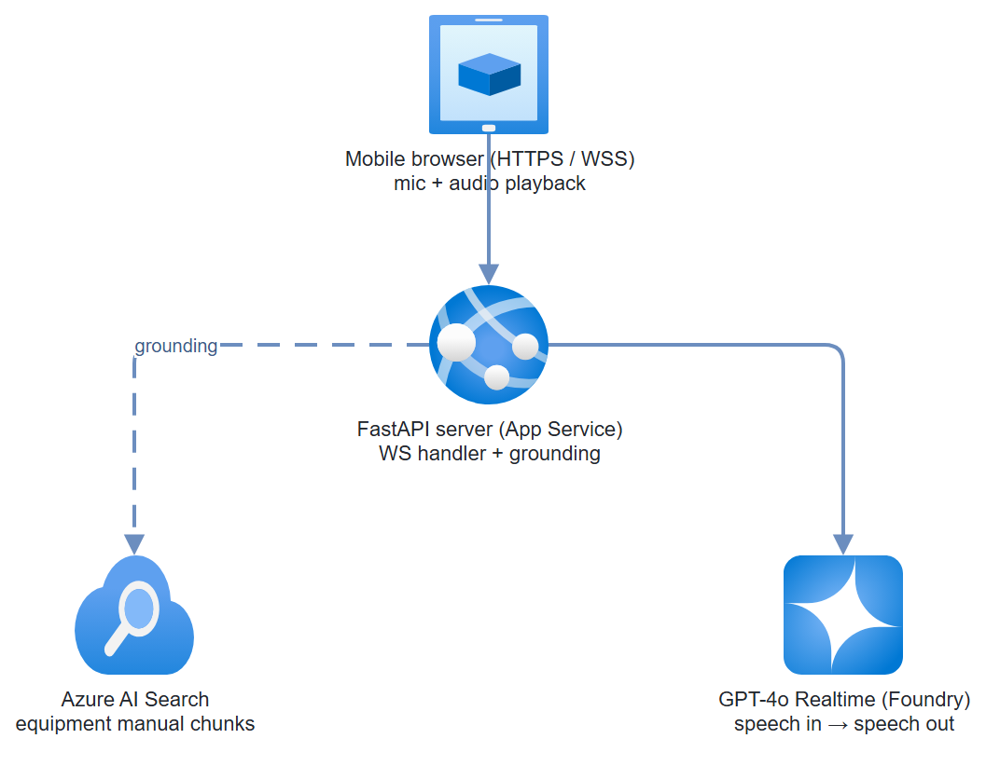

</details>

📘 **Build it:** [Guide 08 — Voice Field Assistant](docs/how-to/08-voice-field-assistant.md)

---

### 9. [Competitive Intelligence Dashboard](docs/how-to/09-competitive-intelligence-dashboard.md)

**Co-build template · 3–4 weeks**

Strategy teams burn 15–20 hours a week manually scanning competitor sites, news, and filings. This agent monitors those sources continuously, summarizes changes, spots trends, and feeds a dashboard. New skills here: web grounding (live internet data) and scheduled agent execution (agents that run on a clock).

**You'll use:** Foundry (prompt agent with Web Search + Code Interpreter), GPT-5.4, Foundry Agent Service (scheduled runs), Cosmos DB, Container Apps, Static Web Apps, Azure Functions.

<details>
<summary>📐 <strong>Architecture diagram</strong></summary>

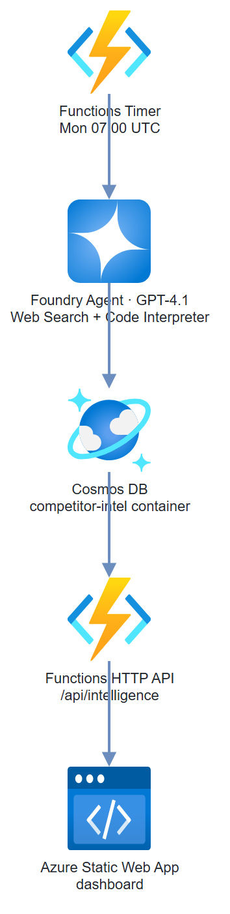

</details>

📘 **Build it:** [Guide 09 — Competitive Intelligence Dashboard](docs/how-to/09-competitive-intelligence-dashboard.md)

---

### 10. [Agentic Workflow for Approvals](docs/how-to/10-agentic-approval-workflow.md)

**Co-build template · 4–6 weeks**

Some things shouldn't be fully autonomous — this project teaches you why. A workflow agent handles multi-step approvals: it reads the request, checks policy, routes to the right approver, chases stale approvals, and logs everything — but a **human makes the actual decision**. The agent prepares; the human approves. The value isn't just speed, it's the audit trail.

**You'll use:** Foundry (workflow agent with human-in-the-loop), Foundry Agent Service, GPT-4.1-mini, Foundry IQ, Service Bus, Cosmos DB, Microsoft Graph API, Entra ID.

<details>
<summary>📐 <strong>Architecture diagram</strong></summary>

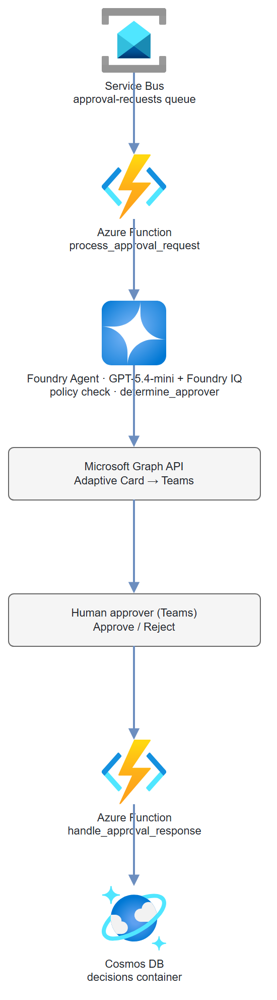

</details>

📘 **Build it:** [Guide 10 — Agentic Approval Workflow](docs/how-to/10-agentic-approval-workflow.md)

---

### 11. [Computer-Use Process Automator](docs/how-to/11-computer-use-automator.md)

**Demo asset · 4–6 weeks**

Every enterprise has a terrible legacy app with no API that someone clicks through for hours daily. GPT-5.4 can see a screen, reason about UI elements, and take actions. Build an agent that automates a repetitive process in a legacy web app — then watch people immediately think of three more they want automated.

> **Always demo with human-in-the-loop confirmation before the agent acts.** An autonomous agent clicking through a production ERP with no guardrails is a horror story, not a demo. Build the safety rails first.

**You'll use:** Foundry, GPT-5.4 with computer-use (Responses API), Container Apps, Microsoft Agent Framework, Azure Key Vault.

<details>
<summary>📐 <strong>Architecture diagram</strong></summary>

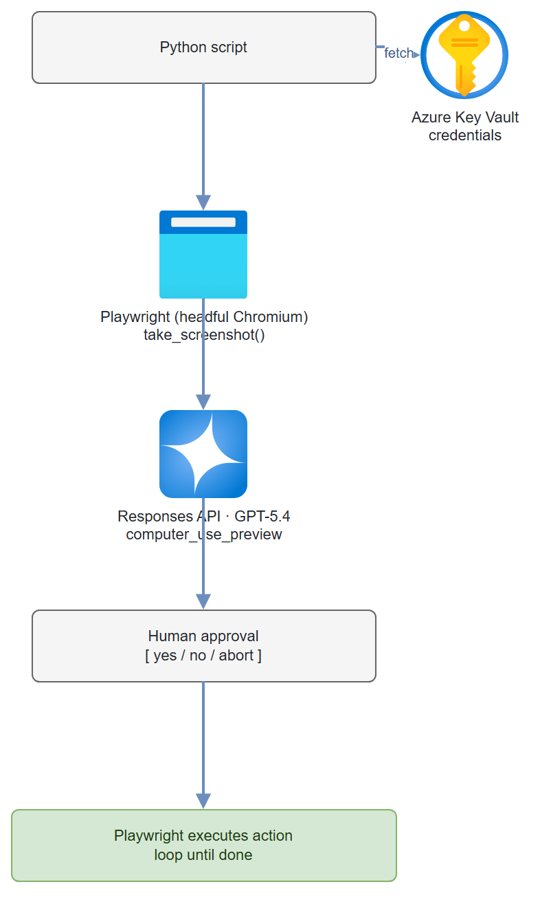

</details>

📘 **Build it:** [Guide 11 — Computer-Use Automator](docs/how-to/11-computer-use-automator.md)

---

### 12. [Multi-Modal Quality Inspector](docs/how-to/12-multimodal-quality-inspector.md)

**Co-build template · 6–8 weeks**

The hardest build here, and the highest-value demo for manufacturing. Production-line cameras capture product images; your agent analyzes them for defects with GPT-5.4 vision, cross-references a defect catalog in Azure AI Search, and triggers alerts or line stops by severity. Multi-modal input, real-time processing, IoT, hosted agents — it touches everything. Don't attempt it until you've built 3–4 of the earlier ideas.

**You'll use:** Foundry (hosted agent with Microsoft Agent Framework), GPT-5.4 (vision), Azure AI Search (image embeddings), Azure IoT Hub, Container Apps, Cosmos DB, Event Hubs, Azure Monitor + Application Insights.

<details>
<summary>📐 <strong>Architecture diagram</strong></summary>

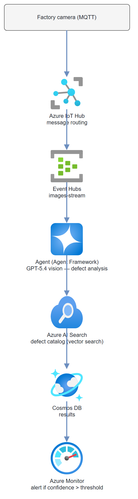

</details>

📘 **Build it:** [Guide 12 — Multi-Modal Quality Inspector](docs/how-to/12-multimodal-quality-inspector.md)

---

### 13. [Foundry Cross-Region Failover — Resilience Blueprint](docs/how-to/13-cross-region-failover.md)

**Production-hardening · Architecture · varies**

The production-hardening guide that turns a demo into something a customer can run in production. Microsoft Foundry has **no native cross-region failover** — if the primary region goes dark, traffic doesn't move on its own. This guide is the blueprint for the failover layer you build yourself: Front Door routing, APIM as an AI gateway, identical model deployments in a paired region, a geo-replicated data layer, and a runbook that handles the part Foundry won't — **recreating stateful Agent Service agents** on failover. You also get the framework to choose Hot/Hot, Hot/Warm, or Hot/Cold against a customer's RTO/RPO and budget. Build this after you've shipped a few of the earlier projects and a customer asks *"but what happens when a region goes down?"*

**You'll use:** Microsoft Foundry (paired regions), Azure Front Door, Azure API Management, Cosmos DB (geo-replication), Azure AI Search, Storage (GZRS/RA-GRS), Key Vault, ACR, Bicep/Terraform, Azure Monitor + Log Analytics.

<details>
<summary>📐 <strong>Architecture diagram</strong></summary>

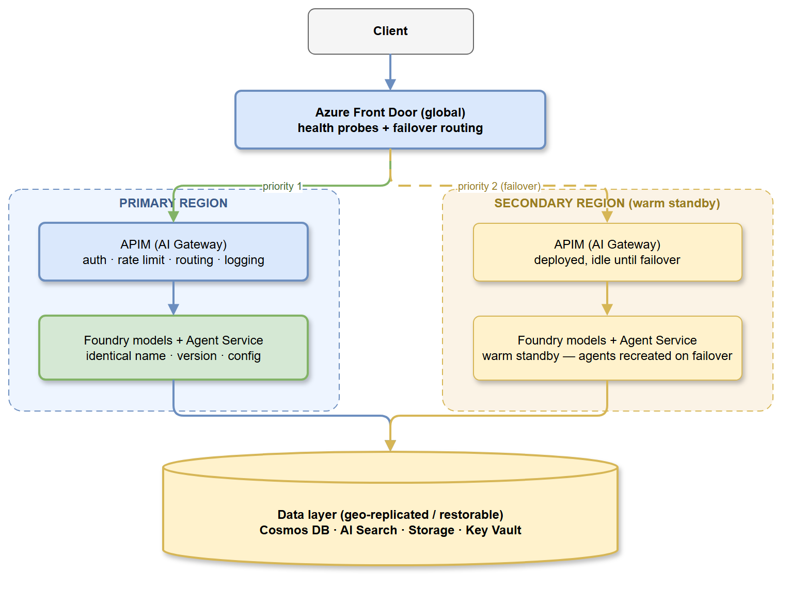

</details>

📘 **Build it:** [Guide 13 — Cross-Region Failover](docs/how-to/13-cross-region-failover.md)

---

## Suggested Build Order

A difficulty-ordered path through the portfolio. The week numbers are a suggested cadence, not a deadline — go at your own pace.

### Phase 1: Foundations — Get Your Hands Dirty

| Week | Build | Why |
|------|-------|-----|
| 1 | [Ask My Docs](docs/how-to/01-ask-my-docs.md) | Foundry basics + RAG in a day. You'll reference this forever. |
| 2 | [Meeting Minutes Agent](docs/how-to/02-meeting-minutes-agent.md) | Audio models + prompt agents. Everyone relates to this one. |
| 3–4 | [Internal Policy Chatbot](docs/how-to/04-policy-chatbot.md) | Foundry IQ. First co-build template you can adapt to any customer. |
| 5–6 | [Customer Email Triage](docs/how-to/03-email-triage-agent.md) | Function calling + multi-model routing. Strong cross-industry co-build. |
| 7–10 | [Multi-Agent Incident Responder](docs/how-to/06-multi-agent-incident-responder.md) | Multi-agent orchestration. The project where everything clicks. |
| 11–12 | Polish + customize | Swap in customer-relevant data. Rehearse the storytelling. |

**After Phase 1:** 4–5 working demos, comfort with Foundry Agent Service, and the ability to spin up a customer POC in a week.

### Phase 2: Co-Build with Real Customers

Pick 2–3 based on who you're actually working with:

- [Contract Clause Analyzer](docs/how-to/05-contract-clause-analyzer.md) — legal/procurement customers
- [Data Pipeline QA Agent](docs/how-to/07-data-pipeline-qa-agent.md) — data platform customers
- [Voice-Enabled Field Assistant](docs/how-to/08-voice-field-assistant.md) — manufacturing/field service
- [Competitive Intelligence Dashboard](docs/how-to/09-competitive-intelligence-dashboard.md) — marketing/strategy

Each teaches a different skill: long-context reasoning, event-driven agents, voice APIs, web grounding. Let your customer conversations guide the choice.

### Phase 3: The Hard Stuff

- [Agentic Workflow for Approvals](docs/how-to/10-agentic-approval-workflow.md) — enterprise workflow automation, human-in-the-loop
- [Computer-Use Process Automator](docs/how-to/11-computer-use-automator.md) — bleeding edge, high wow factor
- [Multi-Modal Quality Inspector](docs/how-to/12-multimodal-quality-inspector.md) — deep industry play, complex architecture
- [Foundry Cross-Region Failover](docs/how-to/13-cross-region-failover.md) — production-hardening: make any of the above survive a region outage in production

These turn you into the person teammates call when they need someone who's done this before.

---

## Architecture Patterns You'll Keep Using

The same patterns show up across these builds:

| Pattern | What it means | Where you'll see it |
|---------|---------------|---------------------|
| **Single prompt agent** | One agent, one job — Q&A, classification, summarization | 1, 2, 4 |
| **Agent + Function Calling** | The agent reads from or writes to external systems | 3, 5, 7 |
| **Workflow agent** | Multi-step process with branching or human approval gates | 6, 10 |
| **Hosted agent** | Full code-level control over the orchestration loop | 11, 12 |
| **Foundry IQ** | Managed RAG — skip the pipeline, bring your docs | 4, 10 |
| **Azure AI Search + custom embeddings** | Control over chunking, hybrid search, or image vectors | 1 (stretch), 8, 9, 12 |
| **Multi-model routing** | Cheap fast model for easy work, expensive model for hard work | 3 |

---

## Which Model for What

Don't overthink it. Here's the cheat sheet:

| What you're doing | Use this | Why |
|-------------------|----------|-----|
| Classification, routing, simple extraction | GPT-4.1-mini | Fast, cheap, accurate enough |
| General Q&A, summarization | GPT-4.1-mini or GPT-5.4-mini | Good quality without burning budget |
| Long documents (contracts, reports) | GPT-5.4 | 1M-token context fits entire docs without chunking |
| Hard reasoning, synthesis across sources | GPT-5.4 or GPT-5.5 | When getting it right matters more than getting it fast |
| Code generation | codex-mini or GPT-5.3-codex | Built for code |
| Voice interaction | GPT-4o Realtime | Low-latency speech-in/speech-out |
| Vision / image analysis | GPT-5.4 | Strong multimodal reasoning |
| Embeddings | text-embedding-3-large | Best retrieval quality (use -3-small if budget is tight) |

> Model recommendations are current as of May 2026 — check the [Foundry Models catalog](https://learn.microsoft.com/azure/foundry/foundry-models/concepts/models-sold-directly-by-azure) for the latest.

---

## Running the Code (Project 01)

The Ask My Docs demo is fully runnable from this repo:

```bash
# Install dependencies
pip install -r requirements.txt

# Configure your endpoint
cp .env.example .env        # then edit AZURE_OPENAI_ENDPOINT

# Authenticate
az login

# Run the RAG demo
python src/ask_my_docs.py

# Clean up vector stores + files after a demo (avoids storage charges)
python src/cleanup.py           # lists, then asks before deleting (ask-my-docs* only)
python src/cleanup.py --delete  # deletes ask-my-docs* stores and their files, no prompt
```

See [Guide 01](docs/how-to/01-ask-my-docs.md) for the full walkthrough, RBAC setup, and a pre-demo checklist.

---

## Contributing

Fork the repo, create a branch, and open a pull request with a short summary and validation notes. For Python changes, install dependencies with `pip install -r requirements.txt` and run:

```bash
python -m compileall src
```

If you change the project list, ordering, models, or roadmap, update this README (the at-a-glance table, the per-project sections, and the roadmap) along with the matching `docs/how-to/NN-<name>.md` guide.

---

## Key Resources

- [Microsoft Foundry portal](https://ai.azure.com)
- [Foundry Agent Service overview](https://learn.microsoft.com/azure/ai-foundry/agents/overview)
- [Microsoft Agent Framework](https://learn.microsoft.com/agent-framework/overview/agent-framework-overview)
- [Foundry Models catalog](https://learn.microsoft.com/azure/foundry/foundry-models/concepts/models-sold-directly-by-azure)
- [Baseline reference architecture](https://learn.microsoft.com/azure/architecture/ai-ml/architecture/baseline-microsoft-foundry-chat)

---

*CSU Cloud & AI — May 2026. All projects run on Microsoft Foundry.*
